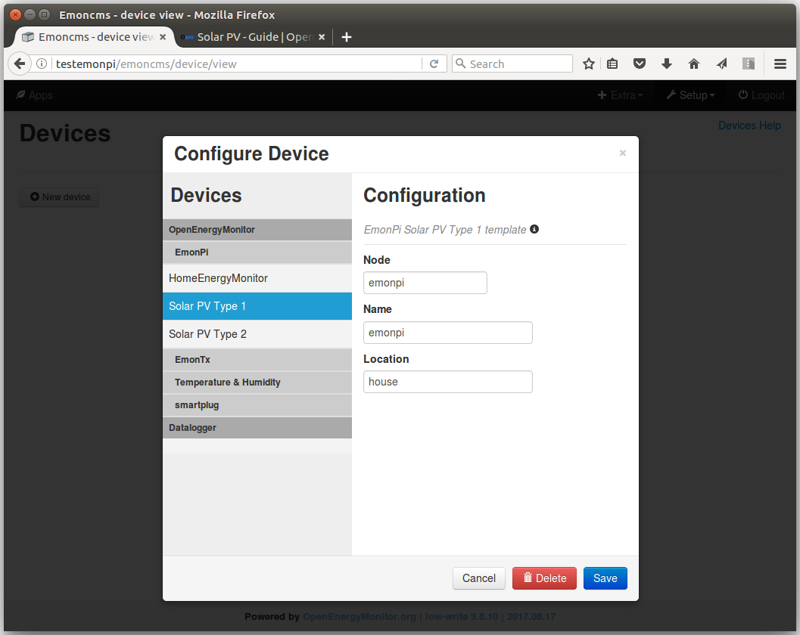
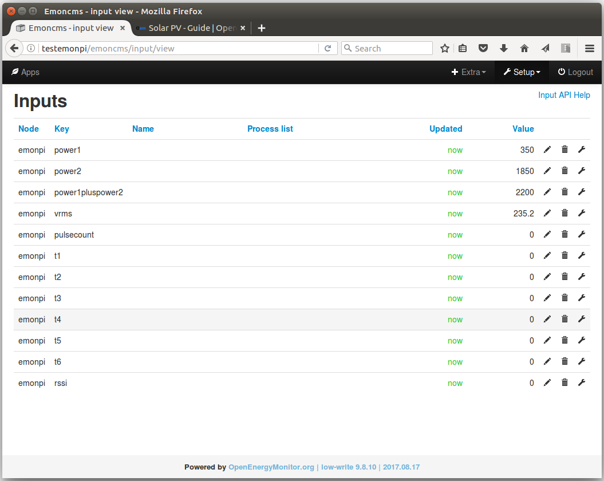
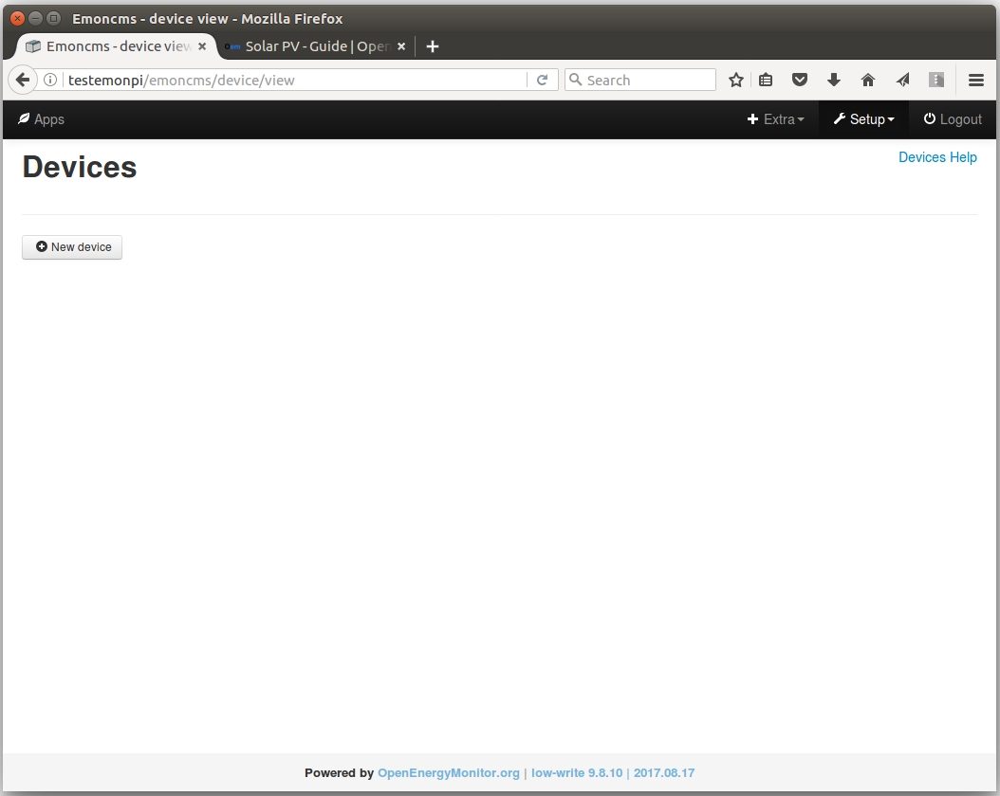
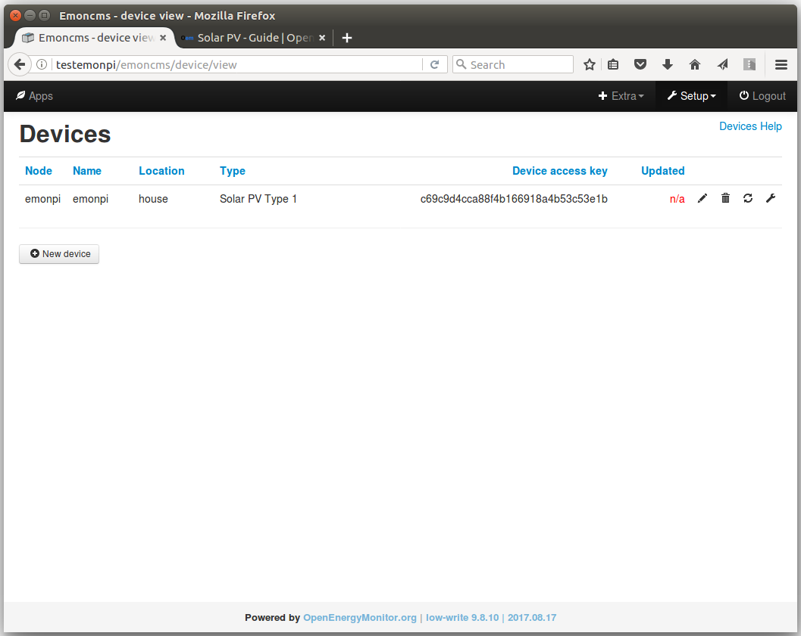
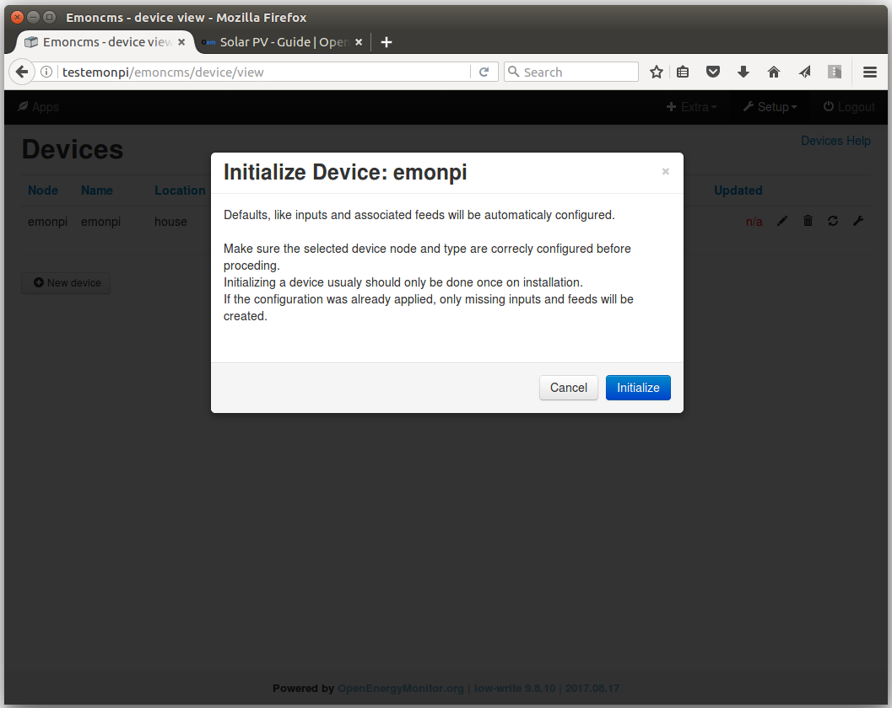
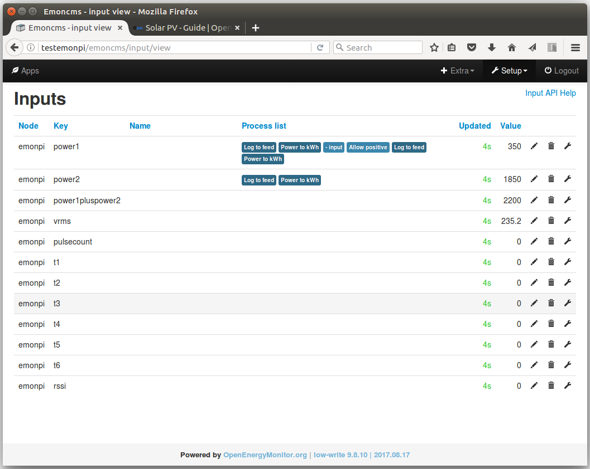
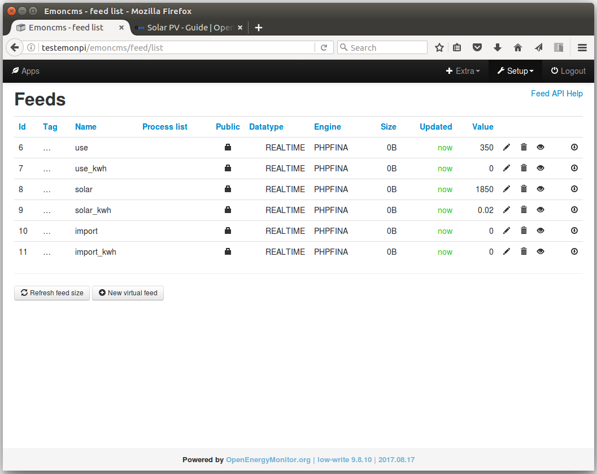

# Emoncms Device module

- Auto-configuration of inputs and feeds from pre-defined device templates
- Device templates available for all standard OpenEnergyMonitor hardware units
- Device level access keys

Original author: [Chaveiro](https://github.com/chaveiro/)
Contributions from: [Trystan Lea](http://github.com/trystanlea), [Adrian Minde](https://github.com/adminde)

## Installation

The following steps document the installation of the device module on a stock emonpi/emonbase running the latest emonSD image.

After logging in via SSH, place the pi in write mode:

    rpi-rw
    
Navigate to the emoncms Modules folder:

    cd /var/www/emoncms/Modules
    
Clone the device module into the modules folder using git:

    git clone https://github.com/emoncms/device.git
    
Switch to the new device-integration branch of the device module

    cd device
    git checkout device-integration
    
Login to emoncms on your emonpi/emonbase, navigate to Setup > Administration, Update the emoncms database by running 'Update & Check' under the Update database section.

## Using the device module

**Auto-configration**

One of the useful features of the device module is automatic configuration of inputs and feeds according to pre-defined device templates.

The following is an example of automatic configuration of an emonpi for use as a Type 1 Solar PV monitor.

With the EmonPi and CT sensors connected up the emoncms inputs list running on the EmonPi should show a list of inputs like so:

These are unconfigured at this point and no data is being recorded. The manual setup for a Type 1 Solar PV setup is documented here [OpenEnergyMonitor Guide: SolarPV](https://guide.openenergymonitor.org/applications/solar-pv), but we are going to use the device module here to automatically setup the inputs and feeds.

Navigate to the device module, click on Setup > Device Setup, which should bring up the following page:

Click on 'New device', this will bring up the 'Configure Device' window. The left-hand pane lists the device templates available.

Click on OpenEnergyMonitor > EmonPi > Solar PV Type 1 to select this template.

Enter the nodename emonpi in both the 'Node' and 'Name' fields, set a location as you wish or leave blank.

Click save to continue.

When a new device is created, it will automatically be initialized and all input processes and feeds will be created, according to the pre-defined template. If the template needs to be applied again, as e.g. a process list was experimented on and altered, or single feeds deleted, it may be re-initialized. Clicking the cycling arrows 'refresh icon' will bring up the initialization window.

Click 'Initialize' to re-initialize the device and to confirm the creation of missing feeds and inputs, as well as the reset of configured processes to their original state.

The input list will now show the input processes created:

and the feeds page the feeds created:

## Development

See: [Development: Devices, Inputs and Feeds in emoncms](https://community.openenergymonitor.org/t/development-devices-inputs-and-feeds-in-emoncms/4281/17)
